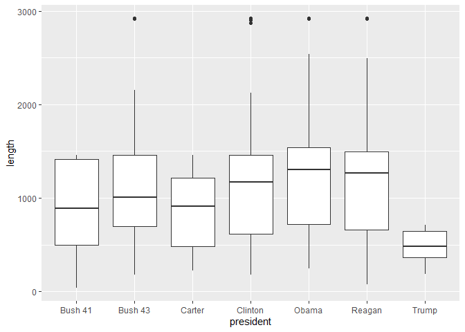
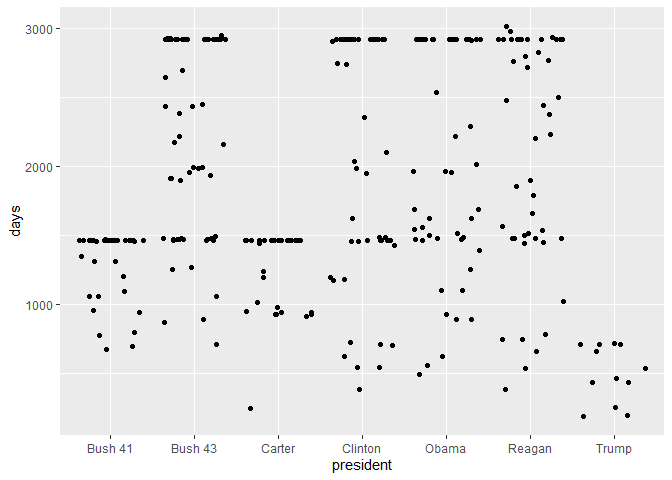
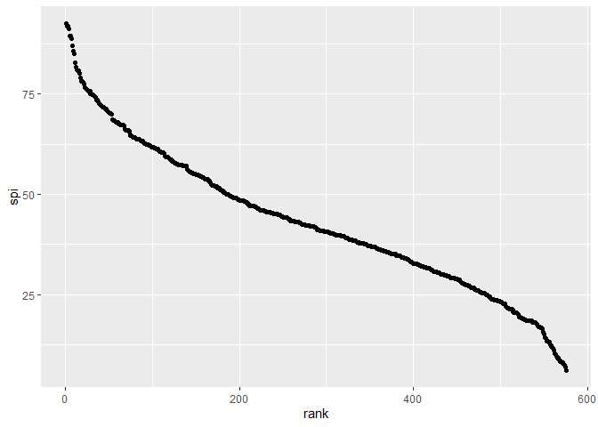
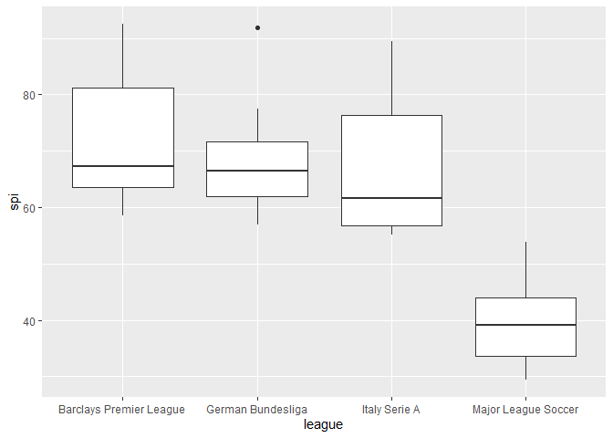

```r
library(tidyverse)
```

```
## -- Attaching packages ---------------------------------------------------------------- tidyverse 1.2.1 --
```

```
## v ggplot2 3.2.1     v purrr   0.3.2
## v tibble  2.1.3     v dplyr   0.8.3
## v tidyr   0.8.3     v stringr 1.4.0
## v readr   1.3.1     v forcats 0.4.0
```

```
## -- Conflicts ------------------------------------------------------------------- tidyverse_conflicts() --
## x dplyr::filter() masks stats::filter()
## x dplyr::lag()    masks stats::lag()
```

```r
library(broom)
library(faraway) #NEW! Be sure to install this package!
library(Sleuth3) #NEW! Need to install this to access the data!
library(GGally)
```

```
## Registered S3 method overwritten by 'GGally':
##   method from   
##   +.gg   ggplot2
```

```
## 
## Attaching package: 'GGally'
```

```
## The following object is masked from 'package:faraway':
## 
##     happy
```

```
## The following object is masked from 'package:dplyr':
## 
##     nasa
```

```r
library(tidyverse)
library(ggridges)
```

```
## 
## Attaching package: 'ggridges'
```

```
## The following object is masked from 'package:ggplot2':
## 
##     scale_discrete_manual
```

```r
library(fivethirtyeight)
```


## Cabinet Turnover Data

```r
ggplot(cabinet_turnover) + geom_boxplot(aes(x=president, y= length))
```

```
## Warning: Removed 30 rows containing non-finite values (stat_boxplot).
```

<!-- -->
We are curious to see how the length each appointee spends at their position
depends on the president in office. In the future we will take in to account the
terms each president served and the days that our current president  is in
office. Without taking that into account we can se that Obama had the highest
median for length of apointee spent in cabinet position.

```r
ggplot(cabinet_turnover) + geom_jitter(aes(x=president, y= days))
```

```
## Warning: Removed 24 rows containing missing values (geom_point).
```

<!-- -->
We are interested in examining what happened during the date that we see
clusters of appointees leaving their position. We would like to examine, outside
of this data set, what events occured to cause this. We noticed that most
appointees leave at either 4 years or 8 years into the presidency.

## SPI Global Rankings


```r
ggplot(spi_global_rankings) +
  geom_point(aes(x=rank, y=spi))
```

<!-- -->

As we guessed the better ranked teams have higher SPI rankings. The relationship is not linear. We wonder if one influences the other or if they are independent.


```r
spi_global_rankings %>% 
  filter(league == "Barclays Premier League" | league == "German Bundesliga" | league == "Italy Serie A" | league == "Major League Soccer") %>% 
  ggplot() +
  geom_boxplot(aes(x=league, y=spi))
```

<!-- -->

We chose 4 of the many leagues to examine in an initial observation. We wanted to compare some of the most premier European leagues agaisnt the MLS. We can see not even the best MLS teams have better SPI scores than the worst of these European leagues. 
