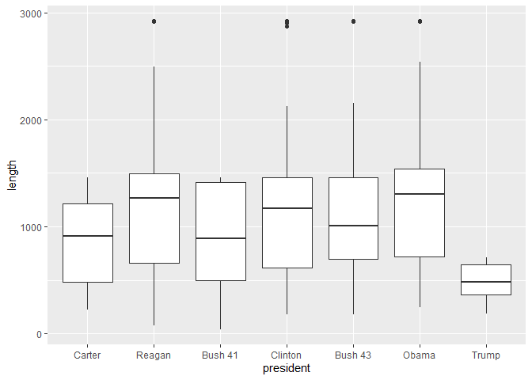

## Cabinet Turnover Data

\
\
\
**Question:** We will be analyzing the data set **cabinet_turnover** from the **fivethirtyeight** package.  This data set includes variables taken from 7 different presidencies, from Jimmy Carter to Donald Trump, summarizing turnover in each of their cabinets.  It was collected from the Federal Government Website News Reports.  Our question is: **What factors effect the length of an appointee's cabinet tenure?**  We will be evaluating how *position* (the cabinet position), *president* (the sitting president), and a variable of our own creation *days_into_term_start* (number of days into the administration the appointee started) affect *length_proportion* (another variable we created that gives us the proportion of *length* to the total number of days an appointee could have served).  

\
\
\
\
\


<!-- -->
\
\
\
\
\
\


<!-- -->
\
\
\
\
\
\

Clearly, there are too many cabinet positions to be legible, so we are picking these few to analyze:  

Secretary of Homeland Security  
EPA Administrator  
Secretary of Health & Human Services  
Secretary of Education  
Secretary of Defense  
Secretary of Labor  
Chief of Staff  

\
\


<!-- -->
\
\
\
\
\
\

New variable *days_into_term_start*: the number of days into the president's term that the appointee started  

\
\


<!-- -->
\
\
\
\
\

New variable *length_proportion*: the proportion of *length* to the total number of days an appointee could have served. For example...  
\
\


<div data-pagedtable="false">
  <script data-pagedtable-source type="application/json">
{"columns":[{"label":["president"],"name":[1],"type":["fctr"],"align":["left"]},{"label":["appointee"],"name":[2],"type":["chr"],"align":["left"]},{"label":["admin_total_days"],"name":[3],"type":["dbl"],"align":["right"]},{"label":["length_proportion"],"name":[4],"type":["dbl"],"align":["right"]}],"data":[{"1":"Carter","2":"Bert Lance","3":"1460","4":"0.1680384"},{"1":"Carter","2":"Brock Adams","3":"1460","4":"0.6236264"},{"1":"Carter","2":"Joseph Califano Jr.","3":"1460","4":"0.6327373"},{"1":"Carter","2":"Patricia Harris","3":"1460","4":"0.6332418"},{"1":"Carter","2":"W. Michael Blumenthal","3":"1460","4":"0.6339286"},{"1":"Carter","2":"Griffin Bell","3":"1460","4":"0.6414315"},{"1":"Carter","2":"Robert Strauss","3":"1460","4":"0.6258993"},{"1":"Carter","2":"James Schlesinger","3":"1460","4":"0.5923870"},{"1":"Carter","2":"Andrew Young","3":"1460","4":"0.6666667"},{"1":"Carter","2":"Juanita Kreps","3":"1460","4":"0.6943681"},{"1":"Carter","2":"Cyrus Vance","3":"1460","4":"0.8179945"},{"1":"Carter","2":"Hamilton Jordan","3":"1460","4":"0.5981818"},{"1":"Carter","2":"Reubin Askew","3":"1460","4":"0.9621053"},{"1":"Carter","2":"Ed Muskie","3":"1460","4":"1.0000000"},{"1":"Carter","2":"Ben Civiletti","3":"1460","4":"1.0019194"},{"1":"Carter","2":"Philip Klutznick","3":"1460","4":"1.0026667"},{"1":"Carter","2":"Jack Watson","3":"1460","4":"1.0090498"},{"1":"Carter","2":"Stansfield Turner","3":"1460","4":"1.0014174"},{"1":"Carter","2":"Douglas Costle","3":"1460","4":"1.0014154"},{"1":"Carter","2":"Jim McIntyre","3":"1460","4":"1.0016502"},{"1":"Carter","2":"A. Vernon Weaver","3":"1460","4":"1.0014409"},{"1":"Carter","2":"Robert Bergland","3":"1460","4":"1.0013736"},{"1":"Carter","2":"Harold Brown","3":"1460","4":"1.0013717"},{"1":"Carter","2":"Shirley Hufstedler","3":"1460","4":"1.0048900"},{"1":"Carter","2":"Charles Duncan","3":"1460","4":"1.0038986"},{"1":"Carter","2":"Patricia Harris","3":"1460","4":"1.0037453"},{"1":"Carter","2":"Moon Landrieu","3":"1460","4":"1.0041494"},{"1":"Carter","2":"Ray Marshall","3":"1460","4":"1.0013774"},{"1":"Carter","2":"Cecil Andrus","3":"1460","4":"1.0013736"},{"1":"Carter","2":"G. William Miller","3":"1460","4":"1.0037665"},{"1":"Carter","2":"Neil Goldschmidt","3":"1460","4":"1.0038314"},{"1":"Carter","2":"Donald McHenry","3":"1460","4":"1.0041408"},{"1":"Carter","2":"Walter Mondale","3":"1460","4":"1.0013708"},{"1":"Reagan","2":"Michael Cardenas","3":"2920","4":"0.1087719"},{"1":"Reagan","2":"Alexander Haig","3":"2920","4":"0.1813507"},{"1":"Reagan","2":"James Edwards","3":"2920","4":"0.2232510"},{"1":"Reagan","2":"Drew Lewis","3":"2920","4":"0.2534294"},{"1":"Reagan","2":"Richard Schweiker","3":"2920","4":"0.2543709"},{"1":"Reagan","2":"Anne Gorsuch","3":"2920","4":"0.2350840"},{"1":"Reagan","2":"James Watt","3":"2920","4":"0.3494513"},{"1":"Reagan","2":"T.H. Bell","3":"2920","4":"0.4931413"},{"1":"Reagan","2":"William Ruckelshaus","3":"2920","4":"0.2882665"},{"1":"Reagan","2":"Don Regan","3":"2920","4":"0.5046280"},{"1":"Reagan","2":"James Baker","3":"2920","4":"0.5053100"},{"1":"Reagan","2":"Donald Hodel","3":"2920","4":"0.3642384"},{"1":"Reagan","2":"William Clark","3":"2920","4":"0.2368839"},{"1":"Reagan","2":"William French Smith","3":"2920","4":"0.5123457"},{"1":"Reagan","2":"Ray Donovan","3":"2920","4":"0.5165289"},{"1":"Reagan","2":"Jeane Kirkpatrick","3":"2920","4":"0.5223829"},{"1":"Reagan","2":"Bill Brock","3":"2920","4":"0.5339506"},{"1":"Reagan","2":"David Stockman","3":"2920","4":"0.5664839"},{"1":"Reagan","2":"Margaret Heckler","3":"2920","4":"0.4717422"},{"1":"Reagan","2":"John Block","3":"2920","4":"0.6337449"},{"1":"Reagan","2":"James Sanders","3":"2920","4":"0.5884956"},{"1":"Reagan","2":"William Casey","3":"2920","4":"0.7530058"},{"1":"Reagan","2":"Don Regan","3":"2920","4":"0.5218295"},{"1":"Reagan","2":"Mac Baldrige","3":"2920","4":"0.8143200"},{"1":"Reagan","2":"Elizabeth Dole","3":"2920","4":"0.7812068"},{"1":"Reagan","2":"Bill Brock","3":"2920","4":"0.6732892"},{"1":"Reagan","2":"Caspar Weinberger","3":"2920","4":"0.8557231"},{"1":"Reagan","2":"Howard Baker","3":"2920","4":"0.7088792"},{"1":"Reagan","2":"Ed Meese","3":"2920","4":"0.8888889"},{"1":"Reagan","2":"James Baker","3":"2920","4":"0.8940443"},{"1":"Reagan","2":"Bill Bennett","3":"2920","4":"0.9174185"},{"1":"Reagan","2":"Jim Miller","3":"2920","4":"0.9214703"},{"1":"Reagan","2":"Kenneth Duberstein","3":"2920","4":"1.0150000"},{"1":"Reagan","2":"Lee Thomas","3":"2920","4":"1.0020848"},{"1":"Reagan","2":"Joseph Wright Jr.","3":"2920","4":"1.0428571"},{"1":"Reagan","2":"Richard Edmund Lyng","3":"2920","4":"1.0028653"},{"1":"Reagan","2":"Frank Carlucci","3":"2920","4":"1.0071259"},{"1":"Reagan","2":"John Herrington","3":"2920","4":"1.0020833"},{"1":"Reagan","2":"Otis Bowen","3":"2920","4":"1.0026525"},{"1":"Reagan","2":"Samuel Pierce Jr.","3":"2920","4":"1.0010288"},{"1":"Reagan","2":"Ann McLaughlin","3":"2920","4":"1.0075000"},{"1":"Reagan","2":"George Shultz","3":"2920","4":"1.0012621"},{"1":"Reagan","2":"Donald Hodel","3":"2920","4":"1.0020848"},{"1":"Reagan","2":"James Burnley IV","3":"2920","4":"1.0072993"},{"1":"Reagan","2":"Clayton Yeutter","3":"2920","4":"1.0023148"},{"1":"Reagan","2":"George H.W. Bush","3":"2920","4":"1.0010277"},{"1":"Reagan","2":"William Verity Jr.","3":"2920","4":"1.0285088"},{"1":"Reagan","2":"Vernon Walters","3":"2920","4":"1.0426647"},{"1":"Reagan","2":"James Abdnor","3":"2920","4":"1.1396396"},{"1":"Reagan","2":"Dick Thornburgh","3":"2920","4":"NA"},{"1":"Reagan","2":"Bill Webster","3":"2920","4":"NA"},{"1":"Reagan","2":"Lauro Cavazos","3":"2920","4":"NA"},{"1":"Reagan","2":"Nicholas Brady","3":"2920","4":"NA"},{"1":"Bush 41","2":"Elizabeth Dole","3":"1460","4":"0.4587345"},{"1":"Bush 41","2":"Lauro Cavazos","3":"1460","4":"NA"},{"1":"Bush 41","2":"Clayton Yeutter","3":"1460","4":"0.5188547"},{"1":"Bush 41","2":"Susan Engeleiter","3":"1460","4":"0.5157049"},{"1":"Bush 41","2":"Dick Thornburgh","3":"1460","4":"NA"},{"1":"Bush 41","2":"Bill Webster","3":"1460","4":"NA"},{"1":"Bush 41","2":"Sam Skinner","3":"1460","4":"0.7212205"},{"1":"Bush 41","2":"John Sununu","3":"1460","4":"0.7258396"},{"1":"Bush 41","2":"Robert Mosbacher","3":"1460","4":"0.7451657"},{"1":"Bush 41","2":"Tom Pickering","3":"1460","4":"0.8171429"},{"1":"Bush 41","2":"Sam Skinner","3":"1460","4":"0.6290727"},{"1":"Bush 41","2":"James Baker","3":"1460","4":"0.8982118"},{"1":"Bush 41","2":"Ed Derwinski","3":"1460","4":"0.9188612"},{"1":"Bush 41","2":"William Barr","3":"1460","4":"0.9928401"},{"1":"Bush 41","2":"Nicholas Brady","3":"1460","4":"NA"},{"1":"Bush 41","2":"Jack Kemp","3":"1460","4":"1.0006969"},{"1":"Bush 41","2":"Lawrence Eagleburger","3":"1460","4":"1.0243902"},{"1":"Bush 41","2":"James Baker","3":"1460","4":"1.0135135"},{"1":"Bush 41","2":"Bob Gates","3":"1460","4":"1.0045558"},{"1":"Bush 41","2":"William Reilly","3":"1460","4":"1.0013870"},{"1":"Bush 41","2":"Dick Darman","3":"1460","4":"1.0013755"},{"1":"Bush 41","2":"Pat Saiki","3":"1460","4":"1.0030166"},{"1":"Bush 41","2":"Ed Madigan","3":"1460","4":"1.0029499"},{"1":"Bush 41","2":"Barbara Franklin","3":"1460","4":"1.0061350"},{"1":"Bush 41","2":"Dick Cheney","3":"1460","4":"1.0014296"},{"1":"Bush 41","2":"Lamar Alexander","3":"1460","4":"1.0029762"},{"1":"Bush 41","2":"James Watkins","3":"1460","4":"1.0014094"},{"1":"Bush 41","2":"Louis Sullivan","3":"1460","4":"1.0014094"},{"1":"Bush 41","2":"Lynn Morley Martin","3":"1460","4":"1.0028129"},{"1":"Bush 41","2":"Manuel Luján Jr.","3":"1460","4":"1.0013841"},{"1":"Bush 41","2":"Andy Card","3":"1460","4":"1.0063898"},{"1":"Bush 41","2":"Carla Hills","3":"1460","4":"1.0013870"},{"1":"Bush 41","2":"Dan Quayle","3":"1460","4":"1.0013708"},{"1":"Bush 41","2":"Edward Perkins","3":"1460","4":"1.0358566"},{"1":"Clinton","2":"Les Aspin","3":"2920","4":"0.1295408"},{"1":"Clinton","2":"Mack McLarty","3":"2920","4":"0.1860226"},{"1":"Clinton","2":"Leon Panetta","3":"2920","4":"0.1857437"},{"1":"Clinton","2":"Erskine Bowles","3":"2920","4":"0.1824011"},{"1":"Clinton","2":"Lloyd Bentsen","3":"2920","4":"0.2396298"},{"1":"Clinton","2":"Mike Espy","3":"2920","4":"0.2427151"},{"1":"Clinton","2":"Jim Woolsey","3":"2920","4":"0.2425078"},{"1":"Clinton","2":"Ron Brown","3":"2920","4":"0.4000686"},{"1":"Clinton","2":"Mickey Kantor","3":"2920","4":"0.4031539"},{"1":"Clinton","2":"Alice Rivlin","3":"2920","4":"0.2438704"},{"1":"Clinton","2":"John Deutch","3":"2920","4":"0.2813853"},{"1":"Clinton","2":"Robert Reich","3":"2920","4":"0.4967432"},{"1":"Clinton","2":"Warren Christopher","3":"2920","4":"0.4994861"},{"1":"Clinton","2":"Henry Cisneros","3":"2920","4":"0.4998286"},{"1":"Clinton","2":"Leon Panetta","3":"2920","4":"0.3863636"},{"1":"Clinton","2":"Hazel O'Leary","3":"2920","4":"0.5001714"},{"1":"Clinton","2":"Mickey Kantor","3":"2920","4":"0.1631246"},{"1":"Clinton","2":"Madeleine Albright","3":"2920","4":"0.4996566"},{"1":"Clinton","2":"William Perry","3":"2920","4":"0.4271654"},{"1":"Clinton","2":"Philip Lader","3":"2920","4":"0.3737462"},{"1":"Clinton","2":"Federico Peña","3":"2920","4":"0.5089102"},{"1":"Clinton","2":"Jesse Brown","3":"2920","4":"0.5562414"},{"1":"Clinton","2":"Frank Raines","3":"2920","4":"0.3875236"},{"1":"Clinton","2":"Federico Peña","3":"2920","4":"0.3375977"},{"1":"Clinton","2":"Bill Richardson","3":"2920","4":"0.3820854"},{"1":"Clinton","2":"Erskine Bowles","3":"2920","4":"0.4375857"},{"1":"Clinton","2":"Bob Rubin","3":"2920","4":"0.7430650"},{"1":"Clinton","2":"Bill Daley","3":"2920","4":"0.8743094"},{"1":"Clinton","2":"Togo West Jr.","3":"2920","4":"0.8218623"},{"1":"Clinton","2":"Bruce Babbitt","3":"2920","4":"0.9948577"},{"1":"Clinton","2":"Carol Browner","3":"2920","4":"1.0006856"},{"1":"Clinton","2":"Jack Lew","3":"2920","4":"1.0020576"},{"1":"Clinton","2":"Dan Glickman","3":"2920","4":"1.0009434"},{"1":"Clinton","2":"Norman Mineta","3":"2920","4":"1.0111111"},{"1":"Clinton","2":"Madeleine Albright","3":"2920","4":"1.0013746"},{"1":"Clinton","2":"Richard Holbrooke","3":"2920","4":"1.0040161"},{"1":"Clinton","2":"Janet Reno","3":"2920","4":"1.0010460"},{"1":"Clinton","2":"John Podesta","3":"2920","4":"1.0036585"},{"1":"Clinton","2":"Aida Alvarez","3":"2920","4":"1.0021246"},{"1":"Clinton","2":"William Cohen","3":"2920","4":"1.0020633"},{"1":"Clinton","2":"Dick Riley","3":"2920","4":"1.0010281"},{"1":"Clinton","2":"Bill Richardson","3":"2920","4":"1.0033975"},{"1":"Clinton","2":"Donna Shalala","3":"2920","4":"1.0010285"},{"1":"Clinton","2":"Andrew Cuomo","3":"2920","4":"1.0020704"},{"1":"Clinton","2":"Alexis Herman","3":"2920","4":"1.0022108"},{"1":"Clinton","2":"Larry Summers","3":"2920","4":"1.0053097"},{"1":"Clinton","2":"Rodney Slater","3":"2920","4":"1.0020935"},{"1":"Clinton","2":"Charlene Barshefsky","3":"2920","4":"1.0021413"},{"1":"Clinton","2":"Al Gore","3":"2920","4":"1.0010277"},{"1":"Clinton","2":"George Tenet","3":"2920","4":"NA"},{"1":"Bush 43","2":"Paul O'Neill","3":"2920","4":"0.2406325"},{"1":"Bush 43","2":"Mitch Daniels","3":"2920","4":"0.2962963"},{"1":"Bush 43","2":"Christine Todd Whitman","3":"2920","4":"0.3015818"},{"1":"Bush 43","2":"Mel Martinez","3":"2920","4":"0.3608919"},{"1":"Bush 43","2":"John Negroponte","3":"2920","4":"0.3765409"},{"1":"Bush 43","2":"George Tenet","3":"2920","4":"NA"},{"1":"Bush 43","2":"Ann Veneman","3":"2920","4":"0.5005139"},{"1":"Bush 43","2":"Rod Paige","3":"2920","4":"0.4998285"},{"1":"Bush 43","2":"John Danforth","3":"2920","4":"0.1104332"},{"1":"Bush 43","2":"Mike Leavitt","3":"2920","4":"0.2348605"},{"1":"Bush 43","2":"Colin Powell","3":"2920","4":"0.5022268"},{"1":"Bush 43","2":"Tommy Thompson","3":"2920","4":"0.5003441"},{"1":"Bush 43","2":"Anthony Principi","3":"2920","4":"0.5020576"},{"1":"Bush 43","2":"Spencer Abraham","3":"2920","4":"0.5042823"},{"1":"Bush 43","2":"Tom Ridge","3":"2920","4":"0.3382151"},{"1":"Bush 43","2":"John Ashcroft","3":"2920","4":"0.5030970"},{"1":"Bush 43","2":"Donald Evans","3":"2920","4":"0.5053100"},{"1":"Bush 43","2":"Robert Zoellick","3":"2920","4":"0.5087901"},{"1":"Bush 43","2":"Gale Norton","3":"2920","4":"0.6482118"},{"1":"Bush 43","2":"Andy Card","3":"2920","4":"0.6543337"},{"1":"Bush 43","2":"Josh Bolten","3":"2920","4":"0.5034449"},{"1":"Bush 43","2":"Porter Goss","3":"2920","4":"0.3730964"},{"1":"Bush 43","2":"Rob Portman","3":"2920","4":"0.2788963"},{"1":"Bush 43","2":"John Snow","3":"2920","4":"0.5710345"},{"1":"Bush 43","2":"Hector Barreto","3":"2920","4":"0.6597146"},{"1":"Bush 43","2":"Norman Mineta","3":"2920","4":"0.6825669"},{"1":"Bush 43","2":"Donald Rumsfeld","3":"2920","4":"0.7392943"},{"1":"Bush 43","2":"John Bolton","3":"2920","4":"0.4082278"},{"1":"Bush 43","2":"John Negroponte","3":"2920","4":"0.4850037"},{"1":"Bush 43","2":"Rob Portman","3":"2920","4":"0.4488108"},{"1":"Bush 43","2":"Alberto Gonzales","3":"2920","4":"0.6620499"},{"1":"Bush 43","2":"Mike Johanns","3":"2920","4":"0.6671242"},{"1":"Bush 43","2":"Jim Nicholson","3":"2920","4":"0.6721992"},{"1":"Bush 43","2":"Alphonso Jackson","3":"2920","4":"0.8436965"},{"1":"Bush 43","2":"Steve Preston","3":"2920","4":"0.7548807"},{"1":"Bush 43","2":"Jim Nussle","3":"2920","4":"1.0039920"},{"1":"Bush 43","2":"Carlos Gutierrez","3":"2920","4":"1.0013889"},{"1":"Bush 43","2":"Dirk Kempthorne","3":"2920","4":"1.0020747"},{"1":"Bush 43","2":"Michael Mukasey","3":"2920","4":"1.0068966"},{"1":"Bush 43","2":"Josh Bolten","3":"2920","4":"1.0029732"},{"1":"Bush 43","2":"Stephen Johnson","3":"2920","4":"1.0022124"},{"1":"Bush 43","2":"Ed Schafer","3":"2920","4":"1.0084507"},{"1":"Bush 43","2":"Margaret Spellings","3":"2920","4":"1.0020633"},{"1":"Bush 43","2":"Samuel Bodman","3":"2920","4":"1.0020747"},{"1":"Bush 43","2":"Mike Leavitt","3":"2920","4":"1.0020661"},{"1":"Bush 43","2":"Steve Preston","3":"2920","4":"1.0132743"},{"1":"Bush 43","2":"Elaine Chao","3":"2920","4":"1.0010309"},{"1":"Bush 43","2":"Condoleezza Rice","3":"2920","4":"1.0020661"},{"1":"Bush 43","2":"Hank Paulson","3":"2920","4":"1.0032538"},{"1":"Bush 43","2":"Mary Peters","3":"2920","4":"1.0036452"},{"1":"Bush 43","2":"James Peake","3":"2920","4":"1.0076142"},{"1":"Bush 43","2":"Susan Schwab","3":"2920","4":"1.0031447"},{"1":"Bush 43","2":"Dick Cheney","3":"2920","4":"1.0010277"},{"1":"Bush 43","2":"Michael Chertoff","3":"2920","4":"1.0027933"},{"1":"Bush 43","2":"Zalmay Khalilzad","3":"2920","4":"1.0079618"},{"1":"Bush 43","2":"Mike McConnell","3":"2920","4":"1.0142045"},{"1":"Bush 43","2":"Michael Hayden","3":"2920","4":"1.0269990"},{"1":"Bush 43","2":"Bob Gates","3":"2920","4":"NA"},{"1":"Obama","2":"Dennis Blair","3":"2920","4":"0.1663230"},{"1":"Obama","2":"Peter Orszag","3":"2920","4":"0.1904762"},{"1":"Obama","2":"Rahm Emanuel","3":"2920","4":"0.2120589"},{"1":"Obama","2":"Leon Panetta","3":"2920","4":"0.2994819"},{"1":"Obama","2":"Bob Gates","3":"2920","4":"NA"},{"1":"Obama","2":"Gary Locke","3":"2920","4":"0.3006307"},{"1":"Obama","2":"Jack Lew","3":"2920","4":"0.1927176"},{"1":"Obama","2":"Bill Daley","3":"2920","4":"0.1725865"},{"1":"Obama","2":"John Bryson","3":"2920","4":"0.1274151"},{"1":"Obama","2":"David Petraeus","3":"2920","4":"0.2193878"},{"1":"Obama","2":"Hilda Solis","3":"2920","4":"0.4951456"},{"1":"Obama","2":"Tim Geithner","3":"2920","4":"0.5012015"},{"1":"Obama","2":"Jack Lew","3":"2920","4":"0.1990077"},{"1":"Obama","2":"Hillary Clinton","3":"2920","4":"0.5044551"},{"1":"Obama","2":"Lisa Jackson","3":"2920","4":"0.5080673"},{"1":"Obama","2":"Leon Panetta","3":"2920","4":"0.2989640"},{"1":"Obama","2":"Ron Kirk","3":"2920","4":"0.5090909"},{"1":"Obama","2":"Ken Salazar","3":"2920","4":"0.5286057"},{"1":"Obama","2":"Steven Chu","3":"2920","4":"0.5318711"},{"1":"Obama","2":"Susan Rice","3":"2920","4":"0.5547545"},{"1":"Obama","2":"Ray LaHood","3":"2920","4":"0.5558985"},{"1":"Obama","2":"Karen Mills","3":"2920","4":"0.5659515"},{"1":"Obama","2":"Janet Napolitano","3":"2920","4":"0.5788211"},{"1":"Obama","2":"Eric Shinseki","3":"2920","4":"0.6699794"},{"1":"Obama","2":"Kathleen Sebelius","3":"2920","4":"0.6611131"},{"1":"Obama","2":"Sylvia Burwell","3":"2920","4":"0.2995595"},{"1":"Obama","2":"Shaun Donovan","3":"2920","4":"0.6896670"},{"1":"Obama","2":"Chuck Hagel","3":"2920","4":"0.5070423"},{"1":"Obama","2":"Eric Holder","3":"2920","4":"0.7817556"},{"1":"Obama","2":"Arne Duncan","3":"2920","4":"0.8687907"},{"1":"Obama","2":"Tom Vilsack","3":"2920","4":"0.9986297"},{"1":"Obama","2":"Ash Carter","3":"2920","4":"1.0028571"},{"1":"Obama","2":"Joe Biden","3":"2920","4":"1.0010277"},{"1":"Obama","2":"James Clapper","3":"2920","4":"1.0012750"},{"1":"Obama","2":"Denis McDonough","3":"2920","4":"1.0020647"},{"1":"Obama","2":"John Kerry","3":"2920","4":"1.0020747"},{"1":"Obama","2":"Jack Lew","3":"2920","4":"1.0021142"},{"1":"Obama","2":"John Brennan","3":"2920","4":"1.0021262"},{"1":"Obama","2":"Sally Jewell","3":"2920","4":"1.0021802"},{"1":"Obama","2":"Ernest Moniz","3":"2920","4":"1.0022438"},{"1":"Obama","2":"Michael Froman","3":"2920","4":"1.0022971"},{"1":"Obama","2":"Penny Pritzker","3":"2920","4":"1.0023059"},{"1":"Obama","2":"Anthony Foxx","3":"2920","4":"1.0023166"},{"1":"Obama","2":"Gina McCarthy","3":"2920","4":"1.0023474"},{"1":"Obama","2":"Tom Perez","3":"2920","4":"1.0023548"},{"1":"Obama","2":"Jeh Johnson","3":"2920","4":"1.0026762"},{"1":"Obama","2":"Maria Contreras-Sweet","3":"2920","4":"1.0029528"},{"1":"Obama","2":"Sylvia Burwell","3":"2920","4":"1.0031480"},{"1":"Obama","2":"Shaun Donovan","3":"2920","4":"1.0033186"},{"1":"Obama","2":"Julián Castro","3":"2920","4":"1.0033186"},{"1":"Obama","2":"Bob McDonald","3":"2920","4":"1.0033259"},{"1":"Obama","2":"Loretta Lynch","3":"2920","4":"1.0047544"},{"1":"Obama","2":"John King Jr.","3":"2920","4":"1.0097087"},{"1":"Obama","2":"Samantha Power","3":"2920","4":"1.0031721"},{"1":"Trump","2":"Reince Priebus","3":"730","4":"0.2592593"},{"1":"Trump","2":"John Kelly","3":"730","4":"0.2592593"},{"1":"Trump","2":"Tom Price","3":"730","4":"0.3262712"},{"1":"Trump","2":"David Shulkin","3":"730","4":"0.5781250"},{"1":"Trump","2":"Rex Tillerson","3":"730","4":"0.5899582"},{"1":"Trump","2":"Mike Pompeo","3":"730","4":"0.6308540"},{"1":"Trump","2":"Scott Pruitt","3":"730","4":"0.7189729"},{"1":"Trump","2":"Jeff Sessions","3":"730","4":"0.8970381"},{"1":"Trump","2":"Jim Mattis","3":"730","4":"0.9739369"},{"1":"Trump","2":"Nikki Haley","3":"730","4":"0.9736842"},{"1":"Trump","2":"John Kelly","3":"730","4":"0.9646182"},{"1":"Trump","2":"Ryan Zinke","3":"730","4":"0.9753266"},{"1":"Trump","2":"Mike Pence","3":"730","4":"NA"},{"1":"Trump","2":"Elaine Chao","3":"730","4":"NA"},{"1":"Trump","2":"Betsy DeVos","3":"730","4":"NA"},{"1":"Trump","2":"Steve Mnuchin","3":"730","4":"NA"},{"1":"Trump","2":"Linda McMahon","3":"730","4":"NA"},{"1":"Trump","2":"Mick Mulvaney","3":"730","4":"NA"},{"1":"Trump","2":"Wilbur Ross","3":"730","4":"NA"},{"1":"Trump","2":"Rick Perry","3":"730","4":"NA"},{"1":"Trump","2":"Ben Carson","3":"730","4":"NA"},{"1":"Trump","2":"Dan Coats","3":"730","4":"NA"},{"1":"Trump","2":"Sonny Perdue","3":"730","4":"NA"},{"1":"Trump","2":"Alexander Acosta","3":"730","4":"NA"},{"1":"Trump","2":"Robert Lighthizer","3":"730","4":"NA"},{"1":"Trump","2":"Kirstjen Nielsen","3":"730","4":"NA"},{"1":"Trump","2":"Alex Azar","3":"730","4":"NA"},{"1":"Trump","2":"Mike Pompeo","3":"730","4":"NA"},{"1":"Trump","2":"Gina Haspel","3":"730","4":"NA"},{"1":"Trump","2":"Robert Wilkie","3":"730","4":"NA"}],"options":{"columns":{"min":{},"max":[10]},"rows":{"min":[10],"max":[10]},"pages":{}}}
  </script>
</div>
\
\
\

<!-- -->
\
\
\
\
\


<!-- -->
\
\
\
\
\

<!-- -->
\
\
\

# Models

<div data-pagedtable="false">
  <script data-pagedtable-source type="application/json">
{"columns":[{"label":["term"],"name":[1],"type":["chr"],"align":["left"]},{"label":["estimate"],"name":[2],"type":["dbl"],"align":["right"]},{"label":["std_error"],"name":[3],"type":["dbl"],"align":["right"]},{"label":["statistic"],"name":[4],"type":["dbl"],"align":["right"]},{"label":["p_value"],"name":[5],"type":["dbl"],"align":["right"]},{"label":["lower_ci"],"name":[6],"type":["dbl"],"align":["right"]},{"label":["upper_ci"],"name":[7],"type":["dbl"],"align":["right"]}],"data":[{"1":"intercept","2":"0.859","3":"0.050","4":"17.196","5":"0.000","6":"0.761","7":"0.957"},{"1":"chronological_presidentReagan","2":"-0.157","3":"0.065","4":"-2.434","5":"0.016","6":"-0.284","7":"-0.030"},{"1":"chronological_presidentBush 41","2":"0.043","3":"0.072","4":"0.593","5":"0.554","6":"-0.100","7":"0.185"},{"1":"chronological_presidentClinton","2":"-0.212","3":"0.065","4":"-3.288","5":"0.001","6":"-0.340","7":"-0.085"},{"1":"chronological_presidentBush 43","2":"-0.163","3":"0.063","4":"-2.592","5":"0.010","6":"-0.287","7":"-0.039"},{"1":"chronological_presidentObama","2":"-0.165","3":"0.064","4":"-2.600","5":"0.010","6":"-0.291","7":"-0.040"},{"1":"chronological_presidentTrump","2":"-0.180","3":"0.097","4":"-1.861","5":"0.064","6":"-0.370","7":"0.010"}],"options":{"columns":{"min":{},"max":[10]},"rows":{"min":[10],"max":[10]},"pages":{}}}
  </script>
</div>
\

Intercept: The average *length_proportion* of an appointee under the Carter administration  
chronological_presidentReagan coefficient: The difference in *length_proportion* for an appointee between Reagan and Carter on average   
\
\

<div data-pagedtable="false">
  <script data-pagedtable-source type="application/json">
{"columns":[{"label":["term"],"name":[1],"type":["chr"],"align":["left"]},{"label":["estimate"],"name":[2],"type":["dbl"],"align":["right"]},{"label":["std_error"],"name":[3],"type":["dbl"],"align":["right"]},{"label":["statistic"],"name":[4],"type":["dbl"],"align":["right"]},{"label":["p_value"],"name":[5],"type":["dbl"],"align":["right"]},{"label":["lower_ci"],"name":[6],"type":["dbl"],"align":["right"]},{"label":["upper_ci"],"name":[7],"type":["dbl"],"align":["right"]}],"data":[{"1":"intercept","2":"0.629","3":"0.067","4":"9.382","5":"0.000","6":"0.495","7":"0.763"},{"1":"positionEPA Administrator","2":"0.062","3":"0.111","4":"0.562","5":"0.576","6":"-0.159","7":"0.284"},{"1":"positionSecretary of Defense","2":"0.117","3":"0.111","4":"1.049","5":"0.298","6":"-0.105","7":"0.338"},{"1":"positionSecretary of Education","2":"0.238","3":"0.122","4":"1.942","5":"0.056","6":"-0.006","7":"0.482"},{"1":"positionSecretary of Health & Human Services","2":"0.093","3":"0.118","4":"0.792","5":"0.431","6":"-0.142","7":"0.329"},{"1":"positionSecretary of Homeland Security","2":"0.007","3":"0.153","4":"0.049","5":"0.961","6":"-0.297","7":"0.312"},{"1":"positionSecretary of Labor","2":"0.158","3":"0.114","4":"1.383","5":"0.171","6":"-0.070","7":"0.386"}],"options":{"columns":{"min":{},"max":[10]},"rows":{"min":[10],"max":[10]},"pages":{}}}
  </script>
</div>
\

Intercept: The average *length_proportion* of a Chief of Staff appointee  
positionEPAadministrator: The difference in *length_proportion* between Chief of Staff and EPA Administrator on average  
\
\

<div data-pagedtable="false">
  <script data-pagedtable-source type="application/json">
{"columns":[{"label":["term"],"name":[1],"type":["chr"],"align":["left"]},{"label":["estimate"],"name":[2],"type":["dbl"],"align":["right"]},{"label":["std.error"],"name":[3],"type":["dbl"],"align":["right"]},{"label":["statistic"],"name":[4],"type":["dbl"],"align":["right"]},{"label":["p.value"],"name":[5],"type":["dbl"],"align":["right"]}],"data":[{"1":"(Intercept)","2":"60.81235540","3":"2.165063981","4":"28.088018","5":"1.959870e-83"},{"1":"days_into_term_start","2":"0.01538928","3":"0.001888219","4":"8.150157","5":"1.222273e-14"}],"options":{"columns":{"min":{},"max":[10]},"rows":{"min":[10],"max":[10]},"pages":{}}}
  </script>
</div>
\

Intercept:  The average *length_proportion* as a percentage for all cabinet positions under all presidents   
The estimate for the *days_into_term_start* coefficient is about 0.015 (as a percent, rather than a decimal).  The p-value is so small, it can be considered 0.  This means that there is a relationship between *days_into_term_start* and *length_proportion* although it is a weak relationship.  
\
\

<div data-pagedtable="false">
  <script data-pagedtable-source type="application/json">
{"columns":[{"label":["term"],"name":[1],"type":["chr"],"align":["left"]},{"label":["estimate"],"name":[2],"type":["dbl"],"align":["right"]},{"label":["std_error"],"name":[3],"type":["dbl"],"align":["right"]},{"label":["statistic"],"name":[4],"type":["dbl"],"align":["right"]},{"label":["p_value"],"name":[5],"type":["dbl"],"align":["right"]},{"label":["lower_ci"],"name":[6],"type":["dbl"],"align":["right"]},{"label":["upper_ci"],"name":[7],"type":["dbl"],"align":["right"]}],"data":[{"1":"intercept","2":"0.804","3":"0.245","4":"3.279","5":"0.002","6":"0.307","7":"1.300"},{"1":"chronological_presidentReagan","2":"-0.116","3":"0.300","4":"-0.386","5":"0.702","6":"-0.724","7":"0.492"},{"1":"chronological_presidentBush 41","2":"-0.014","3":"0.316","4":"-0.045","5":"0.965","6":"-0.655","7":"0.626"},{"1":"chronological_presidentClinton","2":"-0.300","3":"0.300","4":"-1.000","5":"0.324","6":"-0.908","7":"0.307"},{"1":"chronological_presidentBush 43","2":"0.025","3":"0.347","4":"0.072","5":"0.943","6":"-0.677","7":"0.727"},{"1":"chronological_presidentObama","2":"-0.407","3":"0.300","4":"-1.356","5":"0.183","6":"-1.015","7":"0.201"},{"1":"chronological_presidentTrump","2":"-0.192","3":"0.347","4":"-0.553","5":"0.584","6":"-0.893","7":"0.510"},{"1":"positionEPA Administrator","2":"0.198","3":"0.425","4":"0.466","5":"0.644","6":"-0.662","7":"1.057"},{"1":"positionSecretary of Defense","2":"0.198","3":"0.425","4":"0.466","5":"0.644","6":"-0.662","7":"1.057"},{"1":"positionSecretary of Education","2":"0.201","3":"0.425","4":"0.474","5":"0.638","6":"-0.658","7":"1.061"},{"1":"positionSecretary of Health & Human Services","2":"-0.286","3":"0.425","4":"-0.673","5":"0.505","6":"-1.145","7":"0.574"},{"1":"positionSecretary of Homeland Security","2":"-0.353","3":"0.425","4":"-0.831","5":"0.411","6":"-1.212","7":"0.507"},{"1":"positionSecretary of Labor","2":"0.198","3":"0.425","4":"0.466","5":"0.644","6":"-0.662","7":"1.057"},{"1":"chronological_presidentReagan:positionEPA Administrator","2":"-0.377","3":"0.500","4":"-0.754","5":"0.456","6":"-1.390","7":"0.636"},{"1":"chronological_presidentBush 41:positionEPA Administrator","2":"0.014","3":"0.583","4":"0.024","5":"0.981","6":"-1.167","7":"1.195"},{"1":"chronological_presidentClinton:positionEPA Administrator","2":"0.299","3":"0.575","4":"0.521","5":"0.605","6":"-0.864","7":"1.463"},{"1":"chronological_presidentBush 43:positionEPA Administrator","2":"-0.514","3":"0.529","4":"-0.970","5":"0.338","6":"-1.585","7":"0.558"},{"1":"chronological_presidentObama:positionEPA Administrator","2":"0.161","3":"0.520","4":"0.310","5":"0.759","6":"-0.892","7":"1.214"},{"1":"chronological_presidentTrump:positionEPA Administrator","2":"-0.091","3":"0.600","4":"-0.151","5":"0.881","6":"-1.306","7":"1.125"},{"1":"chronological_presidentReagan:positionSecretary of Defense","2":"0.046","3":"0.520","4":"0.088","5":"0.930","6":"-1.007","7":"1.098"},{"1":"chronological_presidentBush 41:positionSecretary of Defense","2":"0.014","3":"0.583","4":"0.024","5":"0.981","6":"-1.167","7":"1.195"},{"1":"chronological_presidentClinton:positionSecretary of Defense","2":"-0.182","3":"0.500","4":"-0.363","5":"0.719","6":"-1.194","7":"0.831"},{"1":"chronological_presidentBush 43:positionSecretary of Defense","2":"-0.287","3":"0.600","4":"-0.478","5":"0.635","6":"-1.502","7":"0.928"},{"1":"chronological_presidentObama:positionSecretary of Defense","2":"0.009","3":"0.500","4":"0.018","5":"0.986","6":"-1.004","7":"1.022"},{"1":"chronological_presidentTrump:positionSecretary of Defense","2":"0.164","3":"0.600","4":"0.274","5":"0.786","6":"-1.051","7":"1.380"},{"1":"chronological_presidentReagan:positionSecretary of Education","2":"-0.184","3":"0.520","4":"-0.353","5":"0.726","6":"-1.236","7":"0.869"},{"1":"chronological_presidentBush 41:positionSecretary of Education","2":"0.012","3":"0.583","4":"0.021","5":"0.983","6":"-1.169","7":"1.193"},{"1":"chronological_presidentClinton:positionSecretary of Education","2":"0.296","3":"0.575","4":"0.516","5":"0.609","6":"-0.867","7":"1.460"},{"1":"chronological_presidentBush 43:positionSecretary of Education","2":"-0.279","3":"0.548","4":"-0.509","5":"0.614","6":"-1.388","7":"0.831"},{"1":"chronological_presidentObama:positionSecretary of Education","2":"0.342","3":"0.520","4":"0.657","5":"0.515","6":"-0.711","7":"1.394"},{"1":"chronological_presidentReagan:positionSecretary of Health & Human Services","2":"0.174","3":"0.500","4":"0.348","5":"0.730","6":"-0.839","7":"1.187"},{"1":"chronological_presidentBush 41:positionSecretary of Health & Human Services","2":"0.498","3":"0.583","4":"0.853","5":"0.399","6":"-0.684","7":"1.679"},{"1":"chronological_presidentClinton:positionSecretary of Health & Human Services","2":"0.783","3":"0.575","4":"1.363","5":"0.181","6":"-0.380","7":"1.947"},{"1":"chronological_presidentBush 43:positionSecretary of Health & Human Services","2":"0.208","3":"0.548","4":"0.380","5":"0.706","6":"-0.901","7":"1.318"},{"1":"chronological_presidentObama:positionSecretary of Health & Human Services","2":"0.721","3":"0.520","4":"1.387","5":"0.173","6":"-0.331","7":"1.774"},{"1":"chronological_presidentBush 43:positionSecretary of Homeland Security","2":"0.195","3":"0.548","4":"0.355","5":"0.725","6":"-0.915","7":"1.304"},{"1":"chronological_presidentObama:positionSecretary of Homeland Security","2":"0.747","3":"0.520","4":"1.437","5":"0.159","6":"-0.306","7":"1.800"},{"1":"chronological_presidentReagan:positionSecretary of Labor","2":"-0.153","3":"0.500","4":"-0.306","5":"0.761","6":"-1.166","7":"0.860"},{"1":"chronological_presidentBush 41:positionSecretary of Labor","2":"-0.256","3":"0.529","4":"-0.484","5":"0.631","6":"-1.328","7":"0.815"},{"1":"chronological_presidentClinton:positionSecretary of Labor","2":"0.048","3":"0.520","4":"0.093","5":"0.926","6":"-1.004","7":"1.101"},{"1":"chronological_presidentBush 43:positionSecretary of Labor","2":"-0.025","3":"0.600","4":"-0.042","5":"0.966","6":"-1.241","7":"1.190"},{"1":"chronological_presidentObama:positionSecretary of Labor","2":"0.155","3":"0.520","4":"0.297","5":"0.768","6":"-0.898","7":"1.207"}],"options":{"columns":{"min":{},"max":[10]},"rows":{"min":[10],"max":[10]},"pages":{}}}
  </script>
</div>
\

Intercept: The average *length_proprtion* for a Chief of Staff appointee under the Carter administration  
chronological_presidentReagan:positionEPA Administrator: The average change in *length_proportion* between a Chief of Staff appointee and EPA Administrator from Carter to Reagan  
\
\
\

# Hypothesis Tests

*president* vs. *length_proportion*  
\

$$
H_0: \beta_1 = \beta_2 = \beta_3 = \beta_4 = 0 \\
H_a: \text{at least one of the } \beta_i \ne 0
$$
\

$H_0$: All coefficients are equal to 0, there is no relationship between *president* and *length_proportion*  
\
\

$H_a$: At least one coefficient is not equal to 0, there is a relationship between *president* and *length_proportion*  
\
\


```
## Warning: Unknown or uninitialised column: 'term'.
```

<div data-pagedtable="false">
  <script data-pagedtable-source type="application/json">
{"columns":[{"label":["res.df"],"name":[1],"type":["dbl"],"align":["right"]},{"label":["rss"],"name":[2],"type":["dbl"],"align":["right"]},{"label":["df"],"name":[3],"type":["dbl"],"align":["right"]},{"label":["sumsq"],"name":[4],"type":["dbl"],"align":["right"]},{"label":["statistic"],"name":[5],"type":["dbl"],"align":["right"]},{"label":["p.value"],"name":[6],"type":["dbl"],"align":["right"]}],"data":[{"1":"281","2":"24.62515","3":"NA","4":"NA","5":"NA","6":"NA"},{"1":"275","2":"22.64224","3":"6","4":"1.98291","5":"4.013885","6":"0.0007160622"}],"options":{"columns":{"min":{},"max":[10]},"rows":{"min":[10],"max":[10]},"pages":{}}}
  </script>
</div>
\

The p-value is about 0.0007, significantly less than 0.05.  This means that we can reject the null hypothesis and there is a strong relationship between *president* and *length_proportion*.  
\
\

Interaction between *president* and *position*  

```
## Warning: Unknown or uninitialised column: 'term'.
```

<div data-pagedtable="false">
  <script data-pagedtable-source type="application/json">
{"columns":[{"label":["res.df"],"name":[1],"type":["dbl"],"align":["right"]},{"label":["rss"],"name":[2],"type":["dbl"],"align":["right"]},{"label":["df"],"name":[3],"type":["dbl"],"align":["right"]},{"label":["sumsq"],"name":[4],"type":["dbl"],"align":["right"]},{"label":["statistic"],"name":[5],"type":["dbl"],"align":["right"]},{"label":["p.value"],"name":[6],"type":["dbl"],"align":["right"]}],"data":[{"1":"67","2":"6.256948","3":"NA","4":"NA","5":"NA","6":"NA"},{"1":"38","2":"4.565619","3":"29","4":"1.691328","5":"0.4854157","6":"0.9766396"}],"options":{"columns":{"min":{},"max":[10]},"rows":{"min":[10],"max":[10]},"pages":{}}}
  </script>
</div>
\

The p-value here is very high, about 0.98.  This means that we cannot reject the null hypothesis - there could be no interaction between *president* and *position*.  
\
\
\

# Summary of Results  
\

- we found that *president* has the most significant effect on *length_proportion*, and that *days_into_term_start* has very little effect  
\

- the p-values for the positions we analyzed were relatively high, indicating little to no relationship between *position* and *length_proportion*, thus we focused on *president*  
\

- interesting to apply statistics to a subject that is so commonly discussed and analyzed (politics)  
\

- we had to create multiple new variables and datasets because some of the existing variables were recorded in a way that was unhelpful or irrelevant to our analysis  
\

- pitfalls included the quantity of positions, and that they weren't all included in every president's administration, some appointees overlapped administrations, there was missing information for some cases (start/end dates)  
\

- other variables that would have been interesting to analyze had they been included in the data set are party, age, gender, previous political experience  
\
\
\


