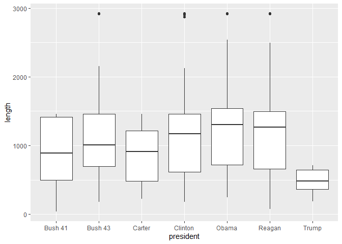
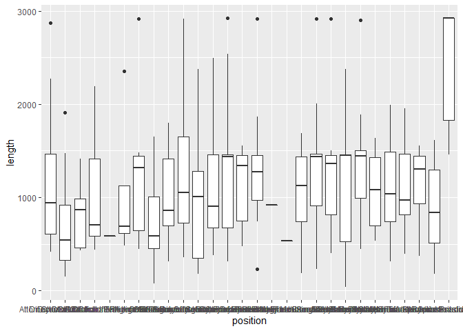
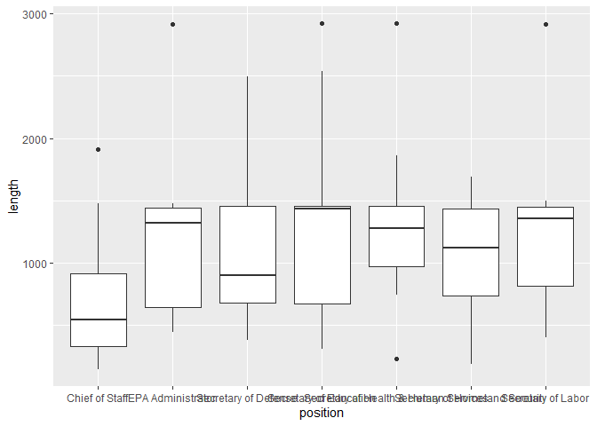
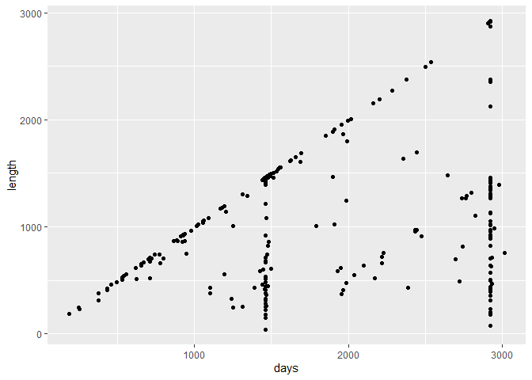
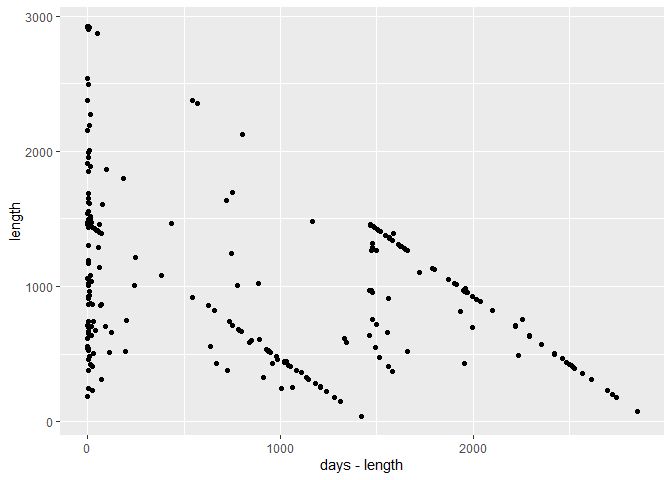

```r
library(tidyverse)
library(broom)
library(faraway) #NEW! Be sure to install this package!
library(Sleuth3) #NEW! Need to install this to access the data!
library(GGally)
library(tidyverse)
library(ggridges)
library(fivethirtyeight)
```


## Cabinet Turnover Data

1.) Introduce your data and research question. Make sure you include a graph/table that summarizes the response variable. Tell us about the important predictor variables you will be evaluating.


```r
ggplot(cabinet_turnover) + geom_boxplot(aes(x=president, y= length))
```

```
## Warning: Removed 30 rows containing non-finite values (stat_boxplot).
```

<!-- -->
We are curious to see how the length each appointee spends at their position
depends on the president in office. In the future we will take in to account the
terms each president served and the days that our current president  is in
office. Without taking that into account we can se that Obama had the highest
median for length of apointee spent in cabinet position.


```r
ggplot(cabinet_turnover) + geom_jitter(aes(x=president, y= days))
```

```
## Warning: Removed 24 rows containing missing values (geom_point).
```

<!-- -->
We are interested in examining what happened during the date that we see
clusters of appointees leaving their position. We would like to examine, outside
of this data set, what events occured to cause this. We noticed that most
appointees leave at either 4 years or 8 years into the presidency.

We are choosing length as our response variable. Our predictors will be President, position, start.
We already have a graph for president.


```r
ggplot(cabinet_turnover) + geom_boxplot(aes(x=position, y= length))
```

```
## Warning: Removed 30 rows containing non-finite values (stat_boxplot).
```

<!-- -->

I wanted to see how many only had one.


```r
cabinet_turnover %>% 
  count(position)
```

```
## # A tibble: 28 x 2
##    position                                          n
##    <fct>                                         <int>
##  1 Attorney General                                 14
##  2 Chief of Staff                                   21
##  3 CIA Director                                      6
##  4 Director of Central Intelligence                  9
##  5 Director of Central Intelligence/CIA Director     1
##  6 Director of National Intelligence                 5
##  7 EPA Administrator                                12
##  8 OMB Director                                     19
##  9 SBA Administrator                                14
## 10 Secretary of Agriculture                         12
## # ... with 18 more rows
```

There are too many cabinet positions so we are picking these few to analyze:

Secretary of Homeland Security
EPA Administrator
Secretary of Health & Human Services
Secretary of Education
Secretary of Defense
Secretary of Labor
Chief of Staff


```r
specified_cabinet_turnover <- cabinet_turnover %>% 
    filter(position == "Secretary of Homeland Security" | position == "EPA Administrator" | position == "Secretary of Health & Human Services" | position == "Secretary of Education" | position == "Secretary of Defense" | position == "Secretary of Labor" | position == "Chief of Staff")
```


```r
ggplot(specified_cabinet_turnover) + geom_boxplot(aes(x=position, y=length))
```

```
## Warning: Removed 8 rows containing non-finite values (stat_boxplot).
```

<!-- -->


```r
cabinet_turnover %>% 
  ggplot() +
  geom_point(aes(x=days, y=length))
```

```
## Warning: Removed 30 rows containing missing values (geom_point).
```

<!-- -->

This doesn't tell us much but it is interesting.


```r
cabinet_turnover %>% 
  ggplot() +
  geom_point(aes(x=days - length, y=length))
```

```
## Warning: Removed 30 rows containing missing values (geom_point).
```

<!-- -->

#```{r}
 //cabinet_turnover %>% 
  augment(startindays = days-length) %>% 
  ggplot() +
  geom_point(aes(x=startindays, y=length)) + 
  x_label()
```


