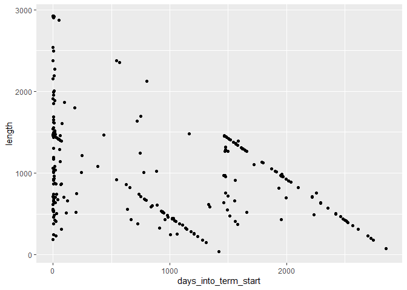

```r
library(tidyverse)
library(broom)
library(faraway) #NEW! Be sure to install this package!
library(Sleuth3) #NEW! Need to install this to access the data!
library(GGally)
library(ggridges)
library(fivethirtyeight)
library(moderndive)
```


## Cabinet Turnover Data

1) Introduce your data and research question. Make sure you include a graph/table that summarizes the response variable. Tell us about the important predictor variables you will be evaluating.

Question: We will be analyzing the data set **cabinet_turnover** from the **fivethirtyeight** package.  This data set includes variables taken from 7 different presidencies, from Jimmy Carter to Donald Trump, summarizing turnover in each of their cabinets.  It was collected from the Federal Government Website News Reports.  Our question is: What factors effect the length of an appointee's cabinet tenure?  We will be evaluating how *position* (the cabinet position), *president* (the sitting president), and a variable of our own creation *days_into_term_start* (number of days into the administration the appointee started) affect *length_proportion* (another variable we created that gives us the proportion of *length* to the total number of days an appointee could have served).  

2) Exploratory work and basic models


```r
ggplot(cabinet_turnover) + geom_boxplot(aes(x=president, y= length))
```

```
## Warning: Removed 30 rows containing non-finite values (stat_boxplot).
```

<!-- -->
We are curious to see how the length each appointee spends in their position depends on the president in office. We will need to take in to account the number of terms each president served and the time that our current president has been in office (this data was taken at Trump's midterm). Without taking that into account we can se that Obama had the highest median for the length an appointee spent in their cabinet position.    


```r
ggplot(cabinet_turnover) + geom_boxplot(aes(x=position, y= length))
```

```
## Warning: Removed 30 rows containing non-finite values (stat_boxplot).
```

<!-- -->

I wanted to see how many only had one.


```r
cabinet_turnover %>% 
  count(position)
```

```
## # A tibble: 28 x 2
##    position                                          n
##    <fct>                                         <int>
##  1 Attorney General                                 14
##  2 Chief of Staff                                   21
##  3 CIA Director                                      6
##  4 Director of Central Intelligence                  9
##  5 Director of Central Intelligence/CIA Director     1
##  6 Director of National Intelligence                 5
##  7 EPA Administrator                                12
##  8 OMB Director                                     19
##  9 SBA Administrator                                14
## 10 Secretary of Agriculture                         12
## # ... with 18 more rows
```

Clearly, there are too many cabinet positions to be legible, so we are picking these few to analyze:  

Secretary of Homeland Security  
EPA Administrator  
Secretary of Health & Human Services  
Secretary of Education  
Secretary of Defense  
Secretary of Labor  
Chief of Staff  


```r
specified_cabinet_turnover <- cabinet_turnover %>% 
    filter(position == "Secretary of Homeland Security" | position == "EPA Administrator" | position == "Secretary of Health & Human Services" | position == "Secretary of Education" | position == "Secretary of Defense" | position == "Secretary of Labor" | position == "Chief of Staff")
```


```r
ggplot(specified_cabinet_turnover) + geom_boxplot(aes(x=position, y=length))
```

```
## Warning: Removed 8 rows containing non-finite values (stat_boxplot).
```

<!-- -->

New variable: the number of days into the president's term that the appointee started  


```r
new_cabinet_turnover <- cabinet_turnover %>% 
  mutate(days_into_term_start = days - length)
```


```r
new_cabinet_turnover %>% 
  ggplot() +
  geom_point(aes(x=days_into_term_start, y=length))
```

```
## Warning: Removed 30 rows containing missing values (geom_point).
```

<!-- -->

This shows that the later into the president's term the appointee started, the shorter the length of their tenure.  The two downward angled lines of points represent those cases that served the maximum length available to them (within the four or eight year term).  


```r
administration_days <- tibble(president = unique(new_cabinet_turnover$president), admin_total_days = c(1460, 2920, 1460, 2920, 2920, 2920, 730))

jointdataset <- full_join(new_cabinet_turnover, administration_days, by = "president")
jointdatasetspecified <- full_join(specified_cabinet_turnover, administration_days, by = "president")
```


*length_proportion* is the proportion of *length* to the total number of days an appointee could have served. For example...


```r
length_prop_dataset <- jointdataset %>% 
  mutate(length_proportion = length/(admin_total_days - (days_into_term_start)))

length_prop_dataset  %>% 
  select("president", "appointee", "admin_total_days", "length_proportion")
```

```
## # A tibble: 312 x 4
##    president appointee             admin_total_days length_proportion
##    <fct>     <chr>                            <dbl>             <dbl>
##  1 Carter    Bert Lance                        1460             0.168
##  2 Carter    Brock Adams                       1460             0.624
##  3 Carter    Joseph Califano Jr.               1460             0.633
##  4 Carter    Patricia Harris                   1460             0.633
##  5 Carter    W. Michael Blumenthal             1460             0.634
##  6 Carter    Griffin Bell                      1460             0.641
##  7 Carter    Robert Strauss                    1460             0.626
##  8 Carter    James Schlesinger                 1460             0.592
##  9 Carter    Andrew Young                      1460             0.667
## 10 Carter    Juanita Kreps                     1460             0.694
## # ... with 302 more rows
```


```r
ggplot(length_prop_dataset) + geom_boxplot(aes(x=president, y= length_proportion))
```

```
## Warning: Removed 30 rows containing non-finite values (stat_boxplot).
```

<!-- -->


```r
length_prop_dataset_specified <- jointdatasetspecified %>% 
  mutate(length_proportion = length/(admin_total_days - (days - length))) %>% 
  select("president", "position", "length_proportion")

length_prop_dataset_specified
```

```
## # A tibble: 88 x 3
##    president position                             length_proportion
##    <fct>     <fct>                                            <dbl>
##  1 Carter    Chief of Staff                                   0.598
##  2 Carter    Chief of Staff                                   1.01 
##  3 Carter    EPA Administrator                                1.00 
##  4 Carter    Secretary of Defense                             1.00 
##  5 Carter    Secretary of Education                           1.00 
##  6 Carter    Secretary of Labor                               1.00 
##  7 Reagan    Secretary of Health & Human Services             0.254
##  8 Reagan    EPA Administrator                                0.235
##  9 Reagan    Secretary of Education                           0.493
## 10 Reagan    EPA Administrator                                0.288
## # ... with 78 more rows
```


```r
ggplot(length_prop_dataset_specified) + geom_boxplot(aes(x=position, y=length_proportion))
```

```
## Warning: Removed 8 rows containing non-finite values (stat_boxplot).
```

<!-- -->


```r
length_prop_dataset %>% 
  ggplot() +
  geom_point(aes(x=days_into_term_start, y=length_proportion))
```

```
## Warning: Removed 30 rows containing missing values (geom_point).
```

<!-- -->


3) Models, interpretations, and hypothesis tests  


```r
lm_president <- lm(length_proportion ~ president, data = length_prop_dataset)

get_regression_table(lm_president)
```

```
## # A tibble: 7 x 7
##   term             estimate std_error statistic p_value lower_ci upper_ci
##   <chr>               <dbl>     <dbl>     <dbl>   <dbl>    <dbl>    <dbl>
## 1 intercept           0.902     0.052    17.2     0        0.799    1.00 
## 2 presidentBush 43   -0.206     0.065    -3.18    0.002   -0.334   -0.078
## 3 presidentCarter    -0.043     0.072    -0.593   0.554   -0.185    0.1  
## 4 presidentClinton   -0.255     0.067    -3.84    0       -0.386   -0.124
## 5 presidentObama     -0.208     0.066    -3.18    0.002   -0.337   -0.079
## 6 presidentReagan    -0.2       0.067    -3.01    0.003   -0.331   -0.069
## 7 presidentTrump     -0.223     0.098    -2.28    0.024   -0.416   -0.03
```

Intercept: The average *length_proportion* of an appointee under the Bush41 administration  
presidentBush43 coefficient: The difference in *length_proportion* for an appointee between Bush41 and Bush43 on average  


```r
lm_position <- lm(length_proportion ~ position, data = length_prop_dataset_specified)

get_regression_table(lm_position)
```

```
## # A tibble: 7 x 7
##   term               estimate std_error statistic p_value lower_ci upper_ci
##   <chr>                 <dbl>     <dbl>     <dbl>   <dbl>    <dbl>    <dbl>
## 1 intercept             0.629     0.067     9.38    0        0.495    0.763
## 2 positionEPA Admin~    0.062     0.111     0.562   0.576   -0.159    0.284
## 3 positionSecretary~    0.117     0.111     1.05    0.298   -0.105    0.338
## 4 positionSecretary~    0.238     0.122     1.94    0.056   -0.006    0.482
## 5 positionSecretary~    0.093     0.118     0.792   0.431   -0.142    0.329
## 6 positionSecretary~    0.007     0.153     0.049   0.961   -0.297    0.312
## 7 positionSecretary~    0.158     0.114     1.38    0.171   -0.07     0.386
```

Intercept: The average *length_proportion* of a Chief of Staff appointee  
positionEPAadministrator: The difference in *length_proportion* between Chief of Staff and EPA Administrator on average  


```r
lm_startdate <- lm(length_proportion ~ days_into_term_start, data = length_prop_dataset)

get_regression_table(lm_startdate)
```

```
## # A tibble: 2 x 7
##   term               estimate std_error statistic p_value lower_ci upper_ci
##   <chr>                 <dbl>     <dbl>     <dbl>   <dbl>    <dbl>    <dbl>
## 1 intercept             0.608     0.022     28.1        0    0.566    0.651
## 2 days_into_term_st~    0         0          8.15       0    0        0
```

The estimate for the *days_into_start* coefficent, and the p-value, is 0.  This reinforces what we could see in the graph, that there is no relationship between *days_into_start* and *length_proportion*.  In other words, the length of an appointee's tenure does not depend on how far into the president's administration they started.  


```r
lm_president_position <- lm(length_proportion ~ president*position, data = length_prop_dataset_specified)

get_regression_table(lm_president_position)
```

```
## # A tibble: 42 x 7
##    term              estimate std_error statistic p_value lower_ci upper_ci
##    <chr>                <dbl>     <dbl>     <dbl>   <dbl>    <dbl>    <dbl>
##  1 intercept            0.789     0.2       3.94    0        0.384    1.20 
##  2 presidentBush 43     0.039     0.316     0.124   0.902   -0.601    0.68 
##  3 presidentCarter      0.014     0.316     0.045   0.965   -0.626    0.655
##  4 presidentClinton    -0.286     0.265    -1.08    0.287   -0.822    0.25 
##  5 presidentObama      -0.393     0.265    -1.48    0.146   -0.929    0.143
##  6 presidentReagan     -0.102     0.265    -0.384   0.703   -0.638    0.434
##  7 presidentTrump      -0.178     0.316    -0.561   0.578   -0.818    0.463
##  8 positionEPA Admi~    0.212     0.4       0.529   0.6     -0.598    1.02 
##  9 positionSecretar~    0.212     0.4       0.53    0.599   -0.598    1.02 
## 10 positionSecretar~    0.214     0.4       0.533   0.597   -0.597    1.02 
## # ... with 32 more rows
```

Intercept: The average *length_proprtion* for a Chief of Staff appointee under the Bush41 administration  
presidentBush43:positionEPAadministrator: The average change in *length_proportion* between a Chief of Staff appointee and EPA Administrator from Bush41 to Bush43  

$$
H_0: \beta_1 = \beta_2 = \beta_3 = \beta_4 = 0 \\
H_a: \text{at least one of the } \beta_i \ne 0
$$

$H_0$: All coefficients are equal to 0, there is no relationship between *president* and *length_proportion*  

$H_a$: At least one coefficient is not equal to 0, there is a relationship between *president* and *length_proportion*  


```r
glance(lm_president) %>% select(r.squared)
```

```
## # A tibble: 1 x 1
##   r.squared
##       <dbl>
## 1    0.0805
```

```r
r_squared_actual <- glance(lm_president) %>% select(r.squared) %>% pull()
```


```r
mod_no_relationship <- lm(length_proportion ~ sample(president), data=length_prop_dataset)
tidy(mod_no_relationship)
```

```
## # A tibble: 7 x 5
##   term                     estimate std.error statistic  p.value
##   <chr>                       <dbl>     <dbl>     <dbl>    <dbl>
## 1 (Intercept)               0.775      0.0530   14.6    3.82e-36
## 2 sample(president)Bush 43 -0.00255    0.0673   -0.0378 9.70e- 1
## 3 sample(president)Carter  -0.0800     0.0750   -1.07   2.87e- 1
## 4 sample(president)Clinton  0.0110     0.0686    0.160  8.73e- 1
## 5 sample(president)Obama   -0.0890     0.0683   -1.30   1.94e- 1
## 6 sample(president)Reagan  -0.111      0.0681   -1.63   1.05e- 1
## 7 sample(president)Trump   -0.0543     0.0770   -0.705  4.81e- 1
```

```r
glance(mod_no_relationship) %>% select(r.squared)
```

```
## # A tibble: 1 x 1
##   r.squared
##       <dbl>
## 1    0.0258
```


```r
set.seed(100)

r_squared <- length_prop_dataset %>% 
  rep_sample_n(size = 312, replace = FALSE, reps = 200) %>% 
  group_by(replicate) %>% 
  do(lm(length_proportion ~ sample(president), data = .) %>% glance()) %>% 
  select(replicate, r.squared)

r_squared
```

```
## # A tibble: 200 x 2
## # Groups:   replicate [200]
##    replicate r.squared
##        <int>     <dbl>
##  1         1   0.0223 
##  2         2   0.0122 
##  3         3   0.0145 
##  4         4   0.00892
##  5         5   0.0207 
##  6         6   0.00891
##  7         7   0.0113 
##  8         8   0.0486 
##  9         9   0.0649 
## 10        10   0.0113 
## # ... with 190 more rows
```


```r
r_squared %>% 
  ggplot(aes(x=r.squared)) +
  geom_histogram(bins = 20) +
  geom_vline(xintercept = 0.08052376, color="red")
```

<!-- -->

This shows that we can reject the null hypothesis.  None of the simulated r.squared values are as extreme as the actual r.squared value.  There is then some relationship between *president* and *length_proportion*.  However, the difference between the most extreme simulated r.squared value and the actual is not significantly large.  

4) Summary of results  

- we found that *president* has the most significant effect on *length_proportion*, and that *days_into_term_start* has no effect  
- the p-values forthe positions we analyzed were relatively high, indicating little to no relationship between *position* and *length_proportion*, thus we focused on *president*  
- interesting to apply statistics to a subject that is so commonly discussed and analyzed (politics)  
- we had to create multiple new variables and datasets because some of the existing variables were recorded in a way that was unhelpful or irrelevant to our analysis  
- pitfalls included the quantity of positions, and that they weren't all included in every president's administration, some appointees overlapped administrations, there was missing information for some cases (start/end dates)  
- other variables that would have been interesting to analyze had they been included in the data set are party, age, gender, previous political experience  


Next steps: Organize work and make it look nice, add echo=false, look at cases (esp in Trump data) that have n/a, discuss and prepare presentation  


